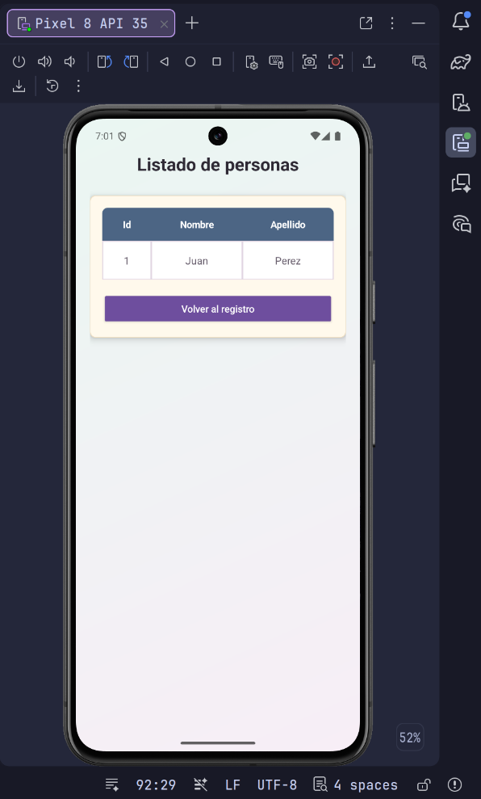
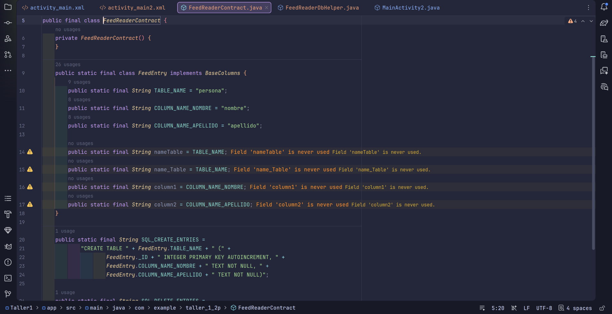
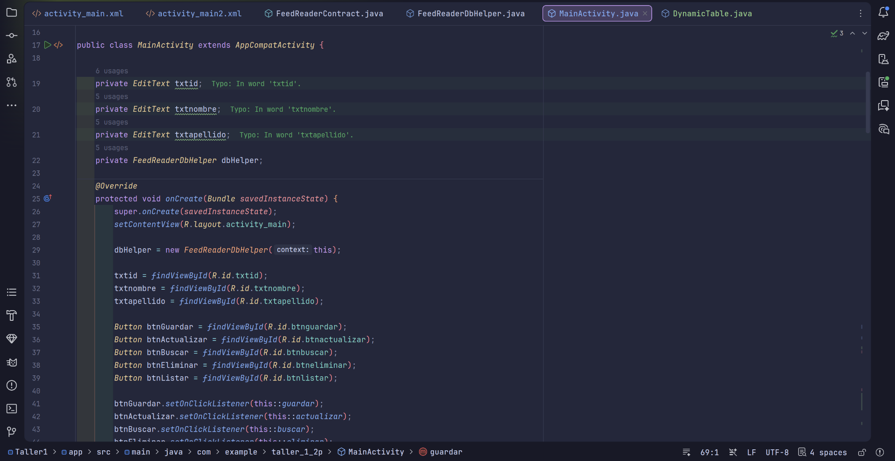
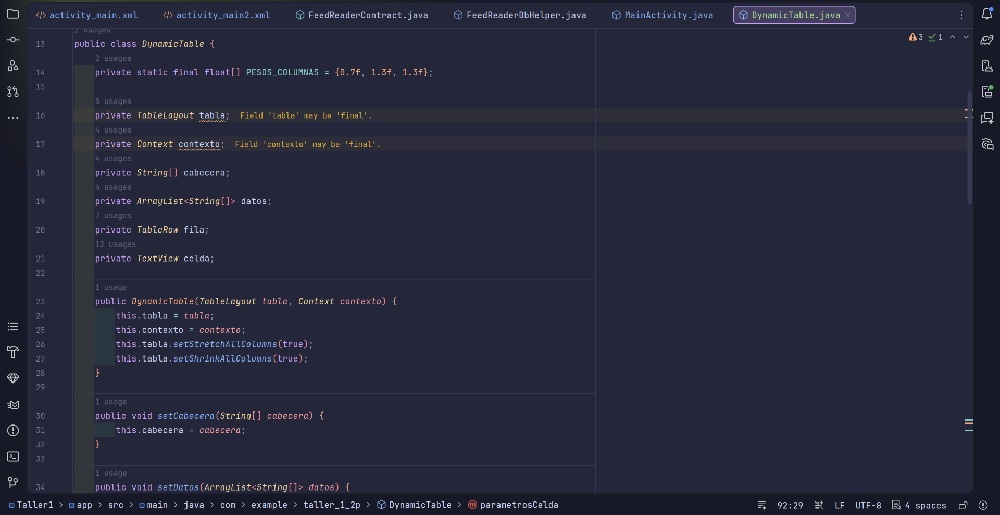
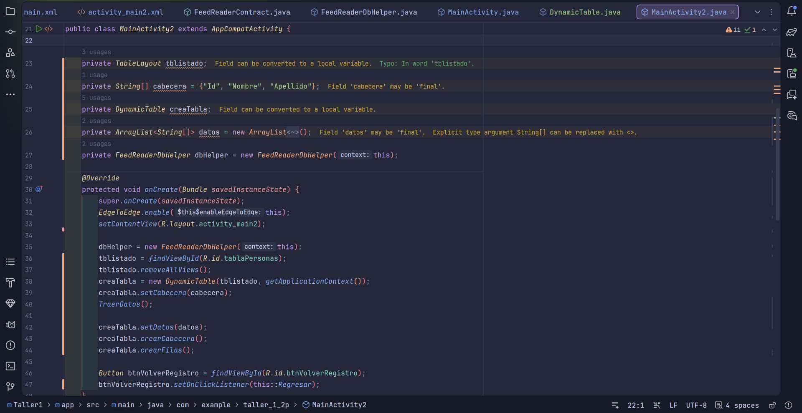

# Taller 1 - Android Studio, SQLite y CRUD de personas

## Objetivo

Desarrollar una aplicacion Android en Java que permita registrar, consultar, actualizar, eliminar y listar personas usando una base de datos SQLite local.

La app trabaja con tres campos principales:

| Campo | Descripcion |
|---|---|
| `id` | Identificador numerico autoincremental usado para buscar, actualizar y eliminar. |
| `nombre` | Nombre de la persona registrada. |
| `apellido` | Apellido de la persona registrada. |

---

## Funcionamiento completo

La aplicacion esta compuesta por dos pantallas:

| Pantalla | Funcion |
|---|---|
| Registro de personas | Permite guardar, buscar, actualizar y eliminar registros. |
| Listado de personas | Muestra los registros existentes en una tabla con encabezado y celdas delimitadas. |

Flujo principal:

1. El usuario ingresa `nombre` y `apellido`.
2. Al presionar `Guardar`, el registro se inserta en SQLite y la app muestra el `id` generado.
3. Para consultar un registro, el usuario escribe el `id` y presiona `Buscar`.
4. Si el registro existe, la app carga `nombre` y `apellido` en el formulario.
5. Con los datos cargados, el usuario puede presionar `Actualizar` para modificar el registro.
6. Para borrar un registro, el usuario escribe el `id` y presiona `Eliminar`.
7. Al presionar `Listar`, se abre la pantalla de listado con una tabla de personas.
8. Si se eliminan todos los registros, la app reinicia la secuencia de SQLite para que el siguiente registro vuelva a iniciar desde `id = 1`.

---

## Capturas de evidencia

Las capturas se encuentran en la carpeta `capturas/` y estan referenciadas con rutas relativas para que se visualicen correctamente en GitHub.

### Captura 1 - Diseno del formulario principal


Se muestra el layout `activity_main.xml` en Android Studio junto con la vista previa del formulario de registro. Incluye los campos `Id`, `Nombre`, `Apellido` y los botones `Guardar`, `Actualizar`, `Buscar`, `Eliminar` y `Listar`.

### Captura 2 - Registro guardado


Se evidencia el guardado de una persona en SQLite. La app muestra un mensaje de confirmacion con el ID generado.

### Captura 3 - Listado con registros


Se muestra la pantalla `Listado de personas`, donde los datos guardados aparecen en una tabla con encabezado, columnas y bordes.

### Captura 4 - Busqueda por ID


Se ingresa un `id` para consultar un registro existente desde el formulario principal.

### Captura 5 - Registro encontrado


La app carga automaticamente el nombre y apellido asociados al `id` buscado y muestra el mensaje `Registro encontrado`.

### Captura 6 - Eliminacion de registro


Se muestra la confirmacion de eliminacion. Cuando la tabla queda vacia, la app reinicia la secuencia de IDs para que el siguiente registro pueda volver a iniciar desde `1`.

### Captura 7 - Listado actualizado



Se evidencia el listado despues de eliminar registros. La tabla se actualiza con los datos restantes.

### Captura 8 - Contrato de la base de datos



Se muestra `FeedReaderContract.java`, donde se define la tabla `persona`, las columnas `nombre` y `apellido`, y la sentencia SQL para crear la tabla con `_id INTEGER PRIMARY KEY AUTOINCREMENT`.

### Captura 9 - Helper de SQLite


Se muestra `FeedReaderDbHelper.java`, clase encargada de crear, actualizar y recrear la base de datos local `Ejemplo.db`.

### Captura 10 - Actividad principal



Se muestra `MainActivity.java`, donde se enlazan los campos y botones del formulario, y se implementan las acciones de guardar, buscar, actualizar, eliminar y abrir el listado.

### Captura 11 - Tabla dinamica



Se muestra `DynamicTable.java`, clase encargada de construir la tabla del listado con encabezados, pesos de columnas, celdas con bordes y fila vacia cuando no hay registros.

### Captura 12 - Actividad de listado



Se muestra `MainActivity2.java`, donde se consultan los registros desde SQLite, se cargan en `DynamicTable` y se permite volver a la pantalla de registro.

---

## Tecnologias utilizadas

| Tecnologia | Uso |
|---|---|
| Android Studio | Entorno de desarrollo y ejecucion en emulador. |
| Java | Lenguaje principal de la aplicacion. |
| XML | Construccion de layouts y recursos visuales. |
| SQLite | Persistencia local de personas. |
| Gradle | Compilacion del proyecto Android. |
| AppCompat | Compatibilidad de actividades Android. |

---

## Archivos principales

| Archivo | Funcion |
|---|---|
| `app/src/main/java/com/example/taller_1_2p/MainActivity.java` | Pantalla principal y operaciones CRUD. |
| `app/src/main/java/com/example/taller_1_2p/MainActivity2.java` | Pantalla de listado y consulta general de registros. |
| `app/src/main/java/com/example/taller_1_2p/DynamicTable.java` | Construccion programatica de la tabla de personas. |
| `app/src/main/java/com/example/taller_1_2p/FeedReaderContract.java` | Contrato de la tabla SQLite y sentencias SQL. |
| `app/src/main/java/com/example/taller_1_2p/FeedReaderDbHelper.java` | Administrador de creacion y actualizacion de la base de datos. |
| `app/src/main/res/layout/activity_main.xml` | Layout del formulario de registro. |
| `app/src/main/res/layout/activity_main2.xml` | Layout del listado de personas. |
| `app/src/main/res/drawable/tabla_cell_background.xml` | Fondo y borde de las celdas de la tabla. |
| `app/src/main/res/drawable/tabla_header_background.xml` | Fondo del encabezado de la tabla. |
| `app/src/main/res/drawable/registro_background.xml` | Fondo general de las pantallas. |
| `app/src/main/res/drawable/registro_card_background.xml` | Fondo de los contenedores principales. |
| `app/src/main/AndroidManifest.xml` | Declaracion de actividades de la aplicacion. |

---

## Base de datos

La aplicacion usa una base de datos SQLite local llamada `Ejemplo.db`.

### Tabla `persona`

| Campo | Tipo | Descripcion |
|---|---|---|
| `_id` | INTEGER PRIMARY KEY AUTOINCREMENT | Identificador unico generado por SQLite. |
| `nombre` | TEXT NOT NULL | Nombre de la persona. |
| `apellido` | TEXT NOT NULL | Apellido de la persona. |

Sentencia de creacion:

```sql
CREATE TABLE persona (
    _id INTEGER PRIMARY KEY AUTOINCREMENT,
    nombre TEXT NOT NULL,
    apellido TEXT NOT NULL
);
```

### Reinicio de IDs

SQLite no reutiliza automaticamente los IDs cuando una tabla usa `AUTOINCREMENT`. Por eso, la aplicacion limpia la secuencia interna cuando se elimina el ultimo registro:

```sql
DELETE FROM sqlite_sequence WHERE name = 'persona';
```

Con este comportamiento, si la tabla queda vacia y luego se guarda una nueva persona, el siguiente registro vuelve a iniciar desde `id = 1`.

---

## Operaciones disponibles

| Operacion | Descripcion |
|---|---|
| Guardar | Inserta una nueva persona con `nombre` y `apellido`. |
| Buscar | Consulta una persona por `id` y carga sus datos en el formulario. |
| Actualizar | Modifica el nombre y apellido del registro indicado por `id`. |
| Eliminar | Borra el registro indicado por `id`. |
| Listar | Abre la segunda actividad y muestra todos los registros en una tabla. |
| Volver al registro | Cierra la pantalla de listado y regresa al formulario. |

---

## Ejecucion del proyecto

Abrir el proyecto en Android Studio y sincronizar Gradle.

Compilar desde terminal:

```bash
./gradlew :app:assembleDebug
```

Ejecutar en un emulador Android, por ejemplo Pixel 8 API 35, o en un dispositivo fisico conectado.

---

## Estado del taller

El taller cuenta con:

| Caracteristica | Estado |
|---|---|
| Formulario de registro | Completo |
| Guardado en SQLite | Completo |
| Busqueda por ID | Completo |
| Actualizacion de registros | Completo |
| Eliminacion de registros | Completo |
| Reinicio de ID al vaciar la tabla | Completo |
| Listado en tabla | Completo |
| Evidencias del flujo y codigo | Completo |

---

## Autor

Juan Diego Sotomayor
