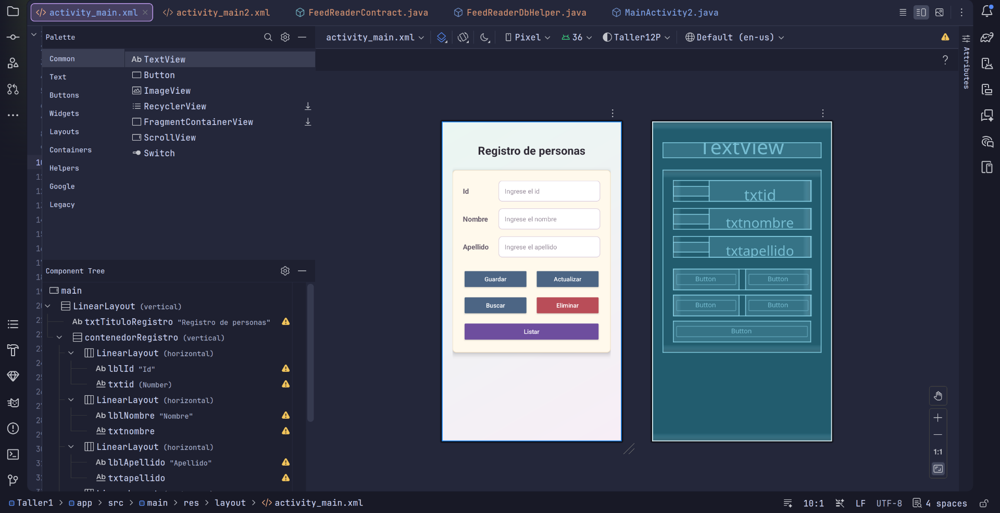
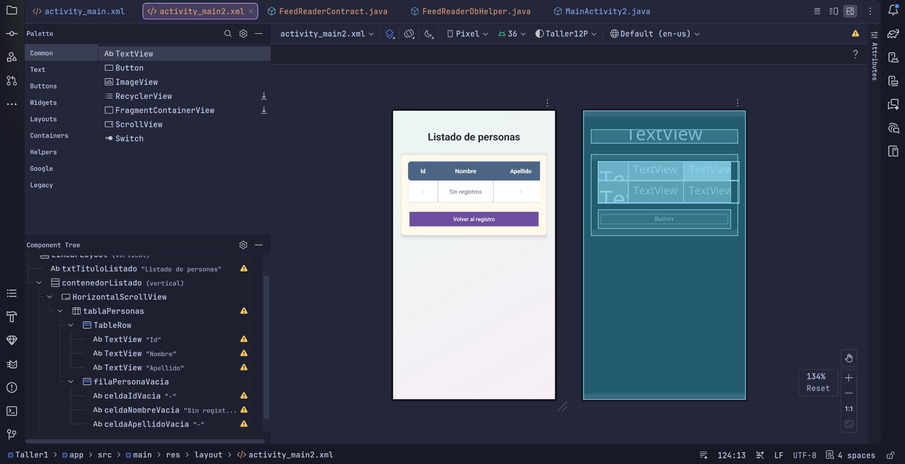
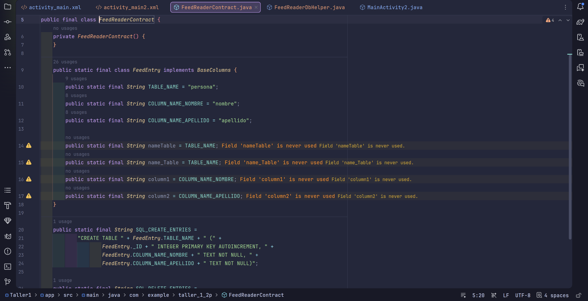
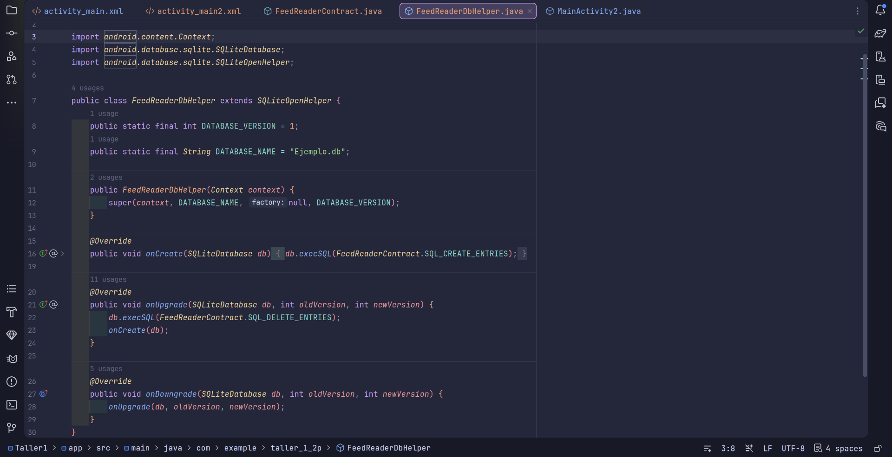
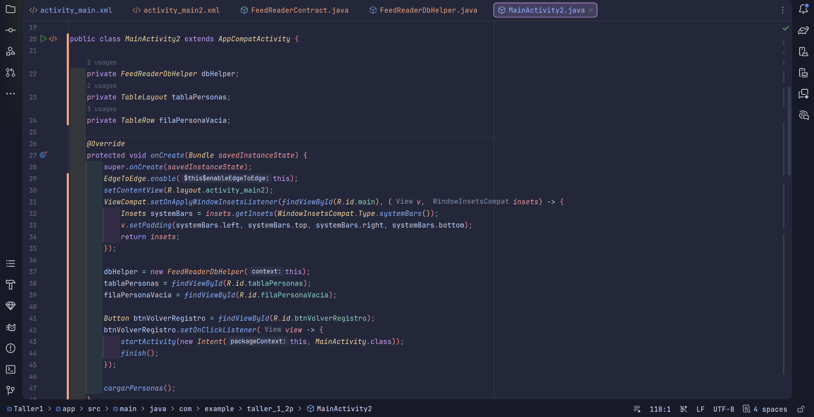

# Taller 1 - Android Studio, SQLite y CRUD de personas

## Objetivo

Desarrollar una aplicación Android básica en Java que permita registrar personas y administrar los datos mediante SQLite.

La aplicación permite guardar, buscar, actualizar, eliminar y listar registros con los campos `id`, `nombre` y `apellido`.

---

## Capturas de evidencia

Las capturas se encuentran en la carpeta `capturas/` y están referenciadas con rutas relativas para que se visualicen en GitHub.

### Capturas principales

| Registro de personas | Listado de personas |
|---|---|
|  |  |
| Se muestra el diseño principal en `activity_main.xml`, con los campos de entrada y botones para las operaciones CRUD. | Se muestra el diseño de `activity_main2.xml`, usado para presentar los registros guardados en una tabla. |

### Captura 3 - Contrato de la base de datos



Se evidencia la clase `FeedReaderContract`, donde se define la tabla `persona`, sus columnas y las sentencias SQL de creación y eliminación.

### Captura 4 - Helper de SQLite



Se muestra `FeedReaderDbHelper`, clase encargada de crear y actualizar la base de datos local `Ejemplo.db`.

### Captura 5 - Actividad de listado



Se muestra parte de `MainActivity2`, donde se carga la tabla de personas desde SQLite y se permite volver al formulario de registro.

---

## Tecnologías utilizadas

| Tecnología | Uso |
|---|---|
| Android Studio | Entorno de desarrollo. |
| Java | Lenguaje principal de la aplicación. |
| XML | Diseño de las pantallas. |
| SQLite | Base de datos local. |
| Gradle | Compilación y gestión del proyecto Android. |
| AppCompat | Compatibilidad de actividades Android. |

---

## Archivos principales

| Archivo | Función |
|---|---|
| `app/src/main/java/com/example/taller_1_2p/MainActivity.java` | Pantalla principal para guardar, buscar, actualizar y eliminar personas. |
| `app/src/main/java/com/example/taller_1_2p/MainActivity2.java` | Pantalla de listado de personas registradas. |
| `app/src/main/java/com/example/taller_1_2p/FeedReaderContract.java` | Define la estructura de la tabla `persona` y las sentencias SQL. |
| `app/src/main/java/com/example/taller_1_2p/FeedReaderDbHelper.java` | Administra la creación y actualización de la base SQLite. |
| `app/src/main/res/layout/activity_main.xml` | Interfaz del formulario de registro. |
| `app/src/main/res/layout/activity_main2.xml` | Interfaz del listado en tabla. |
| `app/src/main/AndroidManifest.xml` | Declaración de actividades de la aplicación. |

---

## Base de datos

La aplicación usa una base de datos SQLite local llamada `Ejemplo.db`.

### Tabla `persona`

| Campo | Tipo | Descripción |
|---|---|---|
| `_id` | INTEGER | Identificador autoincremental. |
| `nombre` | TEXT | Nombre de la persona. |
| `apellido` | TEXT | Apellido de la persona. |

Sentencia principal:

```sql
CREATE TABLE persona (
    _id INTEGER PRIMARY KEY AUTOINCREMENT,
    nombre TEXT NOT NULL,
    apellido TEXT NOT NULL
);
```

---

## Funcionamiento general

1. El usuario abre la aplicación en la pantalla de registro.
2. Ingresa nombre y apellido para guardar una persona.
3. Puede buscar un registro por `id`.
4. Puede actualizar o eliminar el registro encontrado.
5. Al presionar `Listar`, se abre una segunda pantalla con los registros almacenados en SQLite.

---

## Ejecución del proyecto

Abrir el proyecto en Android Studio y sincronizar Gradle.

Compilar desde terminal:

```bash
./gradlew :app:assembleDebug
```

También se puede ejecutar desde Android Studio usando un emulador, por ejemplo Pixel 8.

---

## Estado del taller

El taller cuenta con interfaz XML, dos actividades, persistencia local con SQLite y operaciones CRUD básicas para personas.

---

## Autor

Juan Diego Sotomayor
